<h1 align="center">Hi 👋, I'm Nimish Jain</h1>
<h3 align="center">Software Engineer | MS in Computer Science @ Indiana University Bloomington</h3>

  

---

## 👨‍💻 About Me

- 🎓 Pursuing **Master of Science in Computer Science** at **Indiana University Bloomington**
- 💼 Former **Software Engineer at Deqode Solutions and Software Enfineer Intern at Wappgo**
- 🔭 I build **backend systems, full-stack apps, and AI-powered products**
- 👨‍💻 All my work is here: [GitHub](https://github.com/NIMISH-25)
- 🌐 Portfolio: [nimish.vercel.app](https://nimish.vercel.app)
- 💬 Ask me about **React, TypeScript, Python, Flask, Node.js, Ruby on Rails, PostgreSQL, Redis, Docker, AWS, and ML**
- 📫 Reach me at **jnimish.nj@gmail.com**
- 🤝 Connect on [LinkedIn](https://linkedin.com/in/nimish25)

---

## 🚀 Featured Projects

### 🔹 [Banking-Statement-Analysis](https://github.com/NIMISH-25/Banking-Statement-Analysis)
RAG-based bank statement analysis system built with **Flask, React, Random Forest ML, and ChromaDB**.  
Supports statement upload, financial insight extraction, loan approval prediction, and natural-language Q&A.

### 🔹 [ClipCrunch](https://github.com/NIMISH-25/ClipCrunch)
Distributed video compression and processing app built with **Flask, Next.js, Redis, RQ, FFmpeg, and Docker**.  
Supports background encoding, real-time progress updates, and user-friendly compression presets.

### 🔹 [Human-vs-LLM-Cognitive-Memory-Benchmark](https://github.com/NIMISH-25/Human-vs-LLM-Cognitive-Memory-Benchmark)
Research project comparing **human memory performance vs Google FLAN-T5 Large** across multiple cognitive tasks.  
Includes task-specific datasets, prompting workflows, and evaluation notebooks.

### 🔹 [SpeakToBackend](https://github.com/NIMISH-25/SpeakToBackend)
A natural-language backend interaction project that lets users work with backend services using plain English commands.  
Built as an MVP focused on making backend workflows easier for non-technical users.

---

## 🛠️ Languages and Tools

  

---

## 📊 GitHub Stats

  

---

## 📌 What I Like Building

- Scalable backend systems and APIs
- Full-stack web applications
- Distributed processing workflows
- AI, ML, and RAG-based products
- Developer-focused tools and automation

---

## 🤝 Connect With Me

  
  

